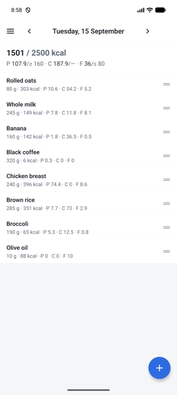
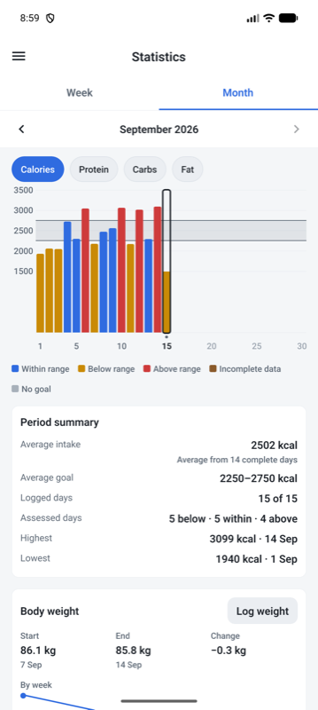
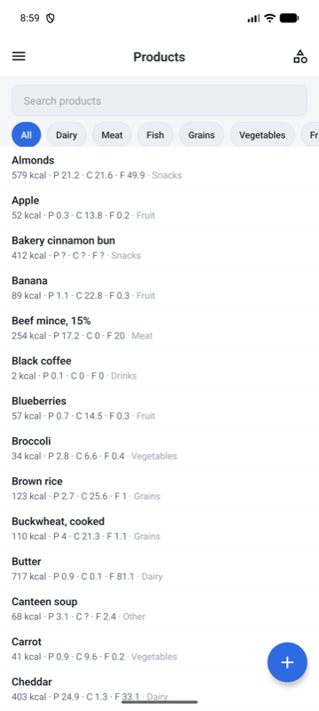
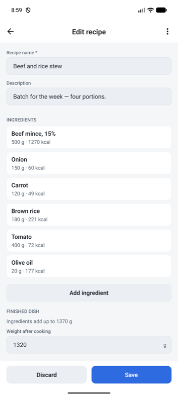
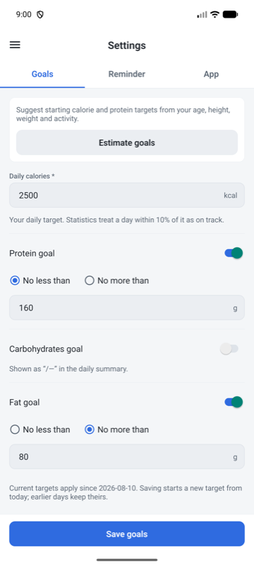

# Pig Tracker

A fully offline calorie and macro tracker for Android. No account, no backend, no network calls —
every byte lives in a local SQLite database on the phone, and the whole app works in airplane mode.

Built with **React Native 0.86 / Expo SDK 57**, **TypeScript (strict)**, and **expo-sqlite**.
No Redux, no UI kit, no third-party bottom-sheet or chart library — state is local to screens,
and the primitives are in-house.

---

## Screenshots

| Day | Statistics | Products |
| :-: | :-: | :-: |
|  |  |  |
| The running total against the day's goal, with each entry's own snapshot. | A month against the goals in force on each day; today is outlined and left out of the averages. | Unknown macros show as `?`, never as zero. |

| Recipes | Goals |
| :-: | :-: |
|  |  |
| Ingredients are snapshots too, and the cooked weight is what per-100 g is derived from. | One value plus a direction per macro, effective-dated so history keeps its own targets. |

---

## What it does

- **Day log** — swipeable day-by-day view of everything eaten, with running calorie and macro totals
  against the day's goal. Bulk-edit mode for deleting or re-weighing several entries at once.
- **Product library** — a seeded preset food list plus your own products, organised by category,
  with per-product variants (e.g. different brands of the same food).
- **Recipes** — compose a dish from library products, then log it by the weight you actually ate.
  Per-100 g values are derived for the finished dish and always presented as approximate.
- **Statistics** — week and month charts of calories and each macro against the goal that was in
  force on each day, day-status breakdown, and a body-weight trend line.
- **Goals** — calorie target plus optional macro bounds, with a Mifflin–St Jeor estimator that
  suggests values from your profile. Goals are effective-dated, so history stays honest.
- **Reminders** — local notifications for the daily log and the weekly weigh-in.
- **English and Ukrainian**, following the device language by default; light, dark and system themes.

---

## Engineering notes

The parts of this codebase worth reading, and why they look the way they do.

### Day entries are immutable snapshots

A logged entry copies the nutrition values it was created with. Editing or deleting the product in
the library afterwards never reaches back into history — yesterday's log still says what you
actually ate. This one rule shapes the whole schema: the library and the day log are separate
tables that share no foreign key you can cascade through.

### Unknown macros are `null`, never `0`

A food with no protein figure is not a food with zero protein. Totals sum only known values and
carry an `incomplete` flag, statistics refuse to classify an incomplete day's macro as adherence,
and a recipe whose ingredient leaves a macro unknown reports `null` for the whole dish rather than
passing a partial sum off as complete. See [`src/domain/nutrition/calculations.ts`](src/domain/nutrition/calculations.ts).

### Editing doesn't accumulate rounding

Users type the values for the amount they ate, but storage is per-100 g. If each weight edit
re-derived the basis from rounded on-screen text, the numbers would drift. Instead the draft keeps
a full-precision `basis` alongside the display text and re-derives the text from it, so you can
change the weight twenty times and land on the same numbers.
See [`src/domain/nutrition/draft.ts`](src/domain/nutrition/draft.ts).

### Search runs in JS, not in SQL

SQLite's `LIKE` only case-folds ASCII. On a Ukrainian food list it matches `капуста` inside
"Квашена капуста" but misses "Капуста білокачанна" — precisely the near-miss that makes a search
feel broken. Matching moved into [`src/domain/search.ts`](src/domain/search.ts), which gets Unicode
case folding and any-order multi-term matching for free; repositories keep the bounded fetching and
the exact filters. A deliberate trade of a little throughput for correctness at this data size.

### Statistics are derived, never stored

No cached aggregate tables to invalidate. Each period is recomputed from the day entries and the
goal rows in force on those dates, so a corrected entry is instantly reflected everywhere. Empty
days are treated as *missing data*, not as zero intake, and today is charted but excluded from
averages and extremes because it isn't finished yet.
See [`src/domain/statistics/`](src/domain/statistics/).

### Charts use a fixed value axis

Gridlines are fixed (1500–4000 by 500 for calories, 50–500 by 50 for macros) rather than fitted to
each period's data, so the same intake sits at the same height in every chart. A chart that rescales
itself makes two weeks impossible to compare by eye.
Constants in [`src/domain/statistics/types.ts`](src/domain/statistics/types.ts), rendering in
[`src/screens/statistics/StatisticsChart.tsx`](src/screens/statistics/StatisticsChart.tsx).

### Explicit save, always

No auto-save anywhere. Screens own an editable draft; repositories are only called on an explicit
Save, and Discard is always available. Deleting a day entry is undoable from the snackbar that
confirms it — the row is restored with its original snapshot, not re-derived from the library.

### No hard-coded user-facing strings

All copy lives in [`src/i18n/en.ts`](src/i18n/en.ts) and [`src/i18n/uk.ts`](src/i18n/uk.ts).
Validation returns error *codes* that the UI renders, dates go through locale-aware formatters, and
a test enforces key parity between the two dictionaries so a missing translation fails CI rather
than shipping as a blank label.

---

## Architecture

```
src/
  domain/          pure TypeScript — no React, no SQL, fully unit-tested
    nutrition/       per-100-g math, editable drafts, display formatting
    goals/           Mifflin–St Jeor estimator, tunable constants, effective-dated lookup
    recipes/         ingredient totals and editor draft
    statistics/      calendar periods, day classification, period summaries
    weight/          body-weight trend
  db/              database.ts (connection + migrations), repositories/* — all SQL lives here
    migrations/      versioned, append-only; never edit a shipped migration
    seed/            preset product list
  screens/         day/ add/ products/ recipes/ statistics/ settings/
  components/      shared primitives: Button, TextField, BottomSheet, Snackbar, Chip, Fab, ...
  theme/           semantic colour tokens + ThemeProvider (system / light / dark)
  i18n/            dictionaries, provider, plural rules
  notifications/   daily log + weekly weighing reminders
  navigation/      drawer + native stack
```

Three layers, one direction of dependency:

**`domain`** is pure functions over plain data — it imports nothing from React or SQLite, which is
why 173 tests run in under two seconds with no emulator and no mocking framework.
**`db`** is the only place that writes SQL; screens never see a query.
**`screens`** own their drafts and call repositories on explicit user action.

Schema changes go through numbered migrations in
[`src/db/migrations/`](src/db/migrations/) — six so far, applied in order on launch and never edited
after shipping, so an existing install upgrades cleanly instead of being reset.

---

## Running it

Prerequisites: Node 20+, JDK 17, Android SDK with platform 36, and a device with USB debugging
enabled (`adb devices` should list it).

```bash
npm install
npx expo prebuild --platform android   # generates ./android (git-ignored)
npm run android:release                # builds a release APK, installs and launches it
```

The release build bundles the JavaScript, so the app keeps working with the phone disconnected.
The APK is also written to `android/app/build/outputs/apk/release/app-release.apk` if you'd rather
copy it across by hand.

For development with hot reload:

```bash
npm run android                        # needs Metro running on the same network
```

## Verifying

```bash
npm run typecheck     # tsc --noEmit, strict mode
npm test              # 173 unit tests across 14 suites
```

---

## Scope

Android-only by design — it targets one device, offline, with no sync story and nothing to sign in
to. The specifications the implementation follows are checked in under [`docs/`](docs/):
[data and behaviour](docs/phase1-data-and-behaviour.md), [UI and interaction](docs/phase1-design.md),
and [statistics](docs/phase2-statistics.md). [`CLAUDE.md`](CLAUDE.md) distils them into the
invariants that must survive future changes.

## Licence

[MIT](LICENSE).
